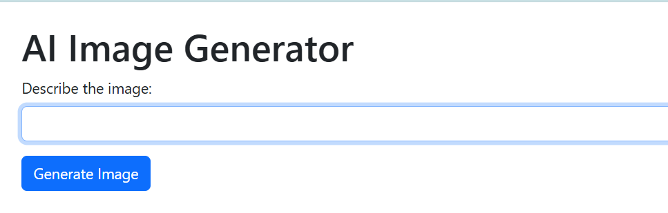
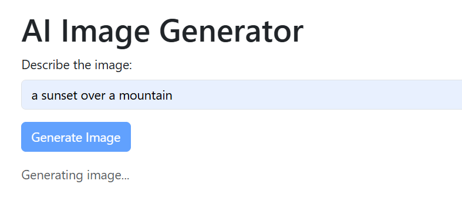
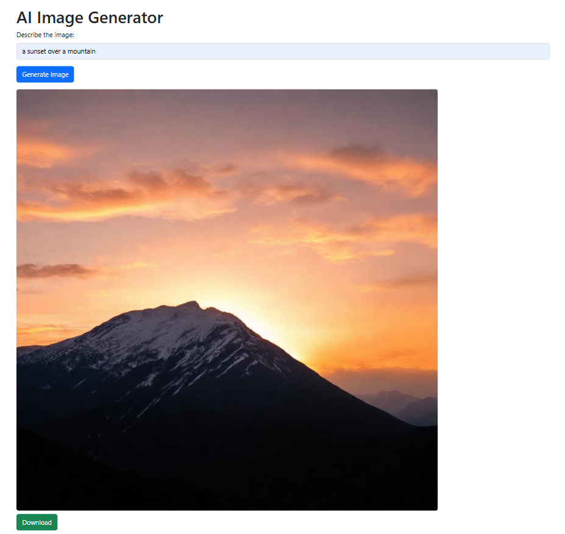

# 🖼️ AI Image Generator (Flask + Stable Diffusion)

A simple yet powerful web app that generates AI images from text prompts using Hugging Face Stable Diffusion 3 via Flask.

---

## ✨ Features

* 🎨 Generate images from text prompts
* ⚡ Fast Flask backend
* 🤖 Powered by Stable Diffusion 3 (Hugging Face API)
* 💾 Base64 image rendering (no file storage needed)
* 🌐 Simple and responsive UI

---

## 🛠️ Tech Stack

* Python
* Flask
* HTML, CSS, JavaScript
* Hugging Face Inference API
* Requests
* python-dotenv

---

## 📁 Project Structure

```text
ImageGenerator/
│── templates/
│   └── index.html
│── screenshots/
│   ├── home.png
│   ├── generating.png
│   └── result.png
│── app.py
│── requirements.txt
│── .gitignore
│── README.md
```

---

## ⚙️ Setup Instructions

### 1. Clone the repo

```bash
git clone https://github.com/PalakD42/ImageGenerator.git
cd ImageGenerator
```

### 2. Install dependencies

```bash
pip install -r requirements.txt
```

### 3. Add environment variables

Create a `.env` file:

```env
HF_API_KEY=your_huggingface_api_key
```

### 4. Run the app

```bash
python app.py
```

Open:

```
http://127.0.0.1:5000
```

---

## 📸 Screenshots

### Home Page



### Generating Image



### Result



---

## 🚨 Common Issues

### Screenshots not showing?

* Ensure images are inside `screenshots/` folder
* Check exact spelling & case (GitHub is case-sensitive)
* Make sure files are pushed:

```bash
git add screenshots/
git commit -m "Add screenshots"
git push
```

---

## 🔮 Future Improvements

* Download button for images
* Image history gallery
* Prompt suggestions
* Dark mode UI
* User login system

---

## 👩‍💻 Author

**Palak**

GitHub: https://github.com/PalakD42

